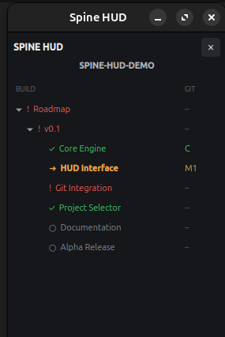

# Spine HUD

Spine HUD is a lightweight visual project roadmap and task HUD for developers.

It keeps the project structure, current work and Git activity visible while you work. The same `spine.json` state can be controlled from the HUD or from the `spine` command line.

> Current release: Ubuntu v0.1.0-alpha

## Installation

Spine HUD currently targets Ubuntu.

Clone the repository and enter the project directory:

    git clone https://github.com/YumaLabFI/spine-hud.git
    cd spine-hud

Create a Python virtual environment:

    python3 -m venv .venv

Activate it:

    source .venv/bin/activate

Install the dependencies:

    pip install -r requirements.txt

Create the `spine` command inside the virtual environment:

    cat > .venv/bin/spine <<EOF
    #!/bin/bash
    SCRIPT_DIR="\$(cd "\$(dirname "\$0")" && pwd)"
    exec "\$SCRIPT_DIR/python" "$(pwd)/src/cli.py" "\$@"
    EOF

    chmod +x .venv/bin/spine

Run the HUD:

    .venv/bin/python src/main.py

For a new project, initialize Spine with:

    .venv/bin/spine init /path/to/project

Then enter that project and verify its roadmap:

    cd /path/to/project
    /path/to/spine-hud/.venv/bin/spine status

The Spine HUD repository itself does not need to be a Spine-managed project.
A system-wide installer is planned for a later release.

## Project tree

Spine organizes work as a tree:

    Roadmap
    └── v0.1
        ├── Core
        ├── UI
        ├── Integration
        ├── Tests
        ├── Docs
        └── Release

Status symbols:

    ○ planned
    ● active
    ! blocked
    ✓ done

Parent branch status is calculated automatically from its children.

## HUD

The HUD currently supports:

- always-on-top project tree
- expandable branches
- unfinished branches open by default
- persistent window position and size
- active task marker
- right-click task actions
- Add child
- Rename
- Remove
- mouse drag-and-drop reordering
- moving tasks between branches
- Git status
- single HUD instance

## CLI

Show the current project:

    spine status

Start a task:

    spine "Task name" start

Complete a task:

    spine "Task name" done

Block a task:

    spine "Task name" block

Add a task:

    spine add "Backend"

Add under a branch:

    spine add "API" --under "Backend"

Rename:

    spine rename "API" "Backend API"

Remove:

    spine remove "Backend API"

Move:

    spine move "API" --before "Tests"
    spine move "API" --after "Tests"
    spine move "API" --under "Backend"

## Initialize a project

Current directory:

    spine init

Another directory:

    spine init /path/to/project

Spine creates a starter `spine.json` and refuses to overwrite an existing one.

## Git

Spine maps project files to tasks.

Git indicators:

    M2      two mapped files have uncommitted changes
    C       mapped work appears in the latest commit
    READY?  active task was committed and has no new mapped changes

`READY?` is only a suggestion. The developer decides when work is actually complete.

## AI assistants

An AI coding assistant can use Spine as the shared project roadmap.

It should first inspect:

    spine status

It can update work using the same commands as the developer.

An AI assistant should keep Spine synchronized with actual project progress and should not mark work done merely because code was generated.

See `docs/AI_ASSISTANT.md` for the dedicated AI Assistant Guide.

## Run the HUD

From the Spine HUD repository:

    .venv/bin/python src/main.py

The startup project selector lets you open registered Spine projects, add projects and reopen the last project automatically if enabled.

Closing the HUD returns to the project selector. Use `QUIT SPINE` to exit Spine completely.

Only one Spine HUD instance can run at a time.

## Project data

Project state is stored in:

    spine.json

Tasks use persistent IDs and explicit ordering.

Writes are validated and saved atomically.

## License

Spine HUD uses PolyForm Noncommercial for noncommercial use.

Commercial use requires a separate commercial license.

See the license file for exact terms.

## Status

Spine HUD is currently under active development. Commands, UI and the project format may still change before a stable release.
