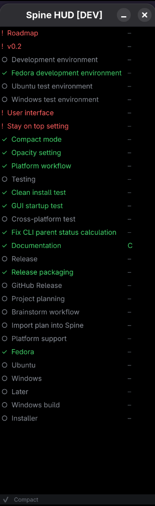
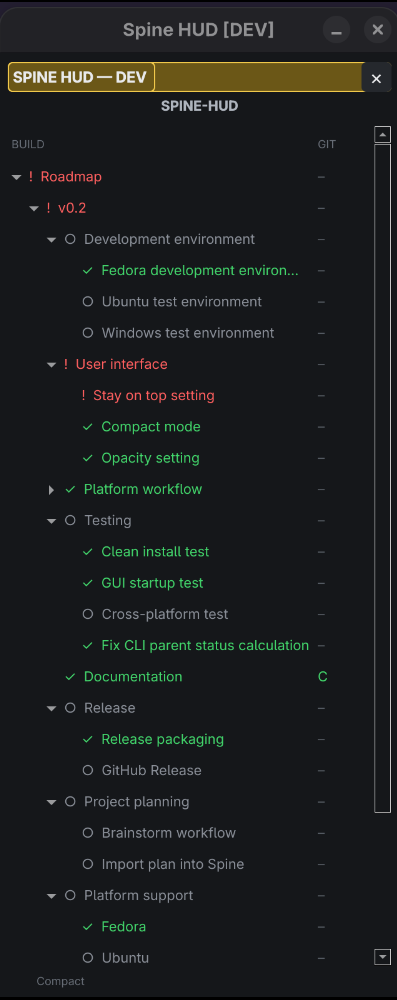
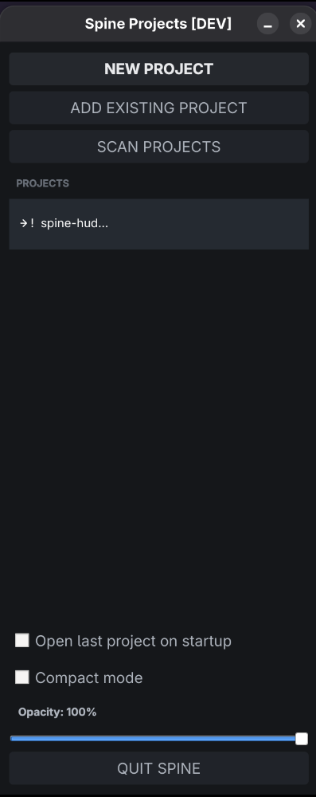

# Spine HUD

Spine HUD is a lightweight visual project roadmap and task HUD for developers.

It keeps the project structure, current work and Git activity visible while you work. The same `spine.json` state can be controlled from the HUD or from the `spine` command line.

> Current test release: v0.2.0-alpha.2

## Installation

Spine HUD v0.2 test releases use a user-local installation.

Clone or extract the release, enter its directory, and run:

    ./packaging/install-v0.2-test.sh

Then launch **Spine HUD v0.2 Test** from the desktop application menu.

The desktop launcher uses `Terminal=false`, so Spine HUD starts without opening a terminal window.

The v0.2 test installation is isolated from the existing v0.1 PRODUCT installation.

Installed locations:

    ~/.local/share/spine-hud-v0.2-test
    ~/.local/bin/spine-hud-v0.2-test
    ~/.local/share/applications/spine-hud-v0.2-test.desktop

Runtime log:

    ~/.local/state/spine-hud-v0.2-test/spine.log

Remove only the v0.2 test installation with:

    ./packaging/uninstall-v0.2-test.sh

## Project tree

Spine organizes work as a tree:

    Roadmap
    └── v0.1
        ├── Core
        ├── UI
        ├── Integration
        ├── Tests
        ├── Docs
        └── Release

Status symbols:

    ○ planned
    ● active
    ! blocked
    ✓ done

Parent branch status is calculated automatically from its children.

## HUD

The HUD currently supports:

- always-on-top project tree
- expandable branches
- unfinished branches open by default
- persistent window position and size
- active task marker
- right-click task actions
- Add child
- Rename
- Remove
- mouse drag-and-drop reordering
- moving tasks between branches
- Git status
- single HUD instance

## CLI

Show the current project:

    spine status

Start a task:

    spine "Task name" start

Complete a task:

    spine "Task name" done

Block a task:

    spine "Task name" block

Add a task:

    spine add "Backend"

Add under a branch:

    spine add "API" --under "Backend"

Rename:

    spine rename "API" "Backend API"

Remove:

    spine remove "Backend API"

Move:

    spine move "API" --before "Tests"
    spine move "API" --after "Tests"
    spine move "API" --under "Backend"

## Initialize a project

Current directory:

    spine init

Another directory:

    spine init /path/to/project

Spine creates a starter `spine.json` and refuses to overwrite an existing one.

## Git

Spine maps project files to tasks.

Git indicators:

    M2      two mapped files have uncommitted changes
    C       mapped work appears in the latest commit
    READY?  active task was committed and has no new mapped changes

`READY?` is only a suggestion. The developer decides when work is actually complete.

## AI assistants

An AI coding assistant can use Spine as the shared project roadmap.

It should first inspect:

    spine status

It can update work using the same commands as the developer.

An AI assistant should keep Spine synchronized with actual project progress and should not mark work done merely because code was generated.

See `docs/AI_ASSISTANT.md` for the dedicated AI Assistant Guide.

## Run the HUD

Installed release:

Launch **Spine HUD v0.2 Test** from the desktop application menu.

Development checkout:

    SPINE_ENV=dev QT_QPA_PLATFORM=xcb PYTHONPATH=src .venv/bin/python src/main.py

The startup project selector opens registered Spine projects and can reopen the last project automatically.

Closing the HUD returns to the project selector. Use `QUIT SPINE` to exit completely.

Only one Spine HUD instance can run at a time.

## Project data

Project state is stored in:

    spine.json

Tasks use persistent IDs and explicit ordering.

Writes are validated and saved atomically.

## License

Spine HUD uses PolyForm Noncommercial for noncommercial use.

Commercial use requires a separate commercial license.

See the license file for exact terms.

## Spine project format

The public v0.2 Spine project format is documented here:

- [`docs/SPINE_FORMAT.md`](docs/SPINE_FORMAT.md)
- [`examples/spine.json`](examples/spine.json)

Use these when creating integrations or generating a Spine project file.
Do not infer the schema only from the rendered roadmap.

## Development roadmap

Spine HUD uses Spine itself to track development.

The current public build tree is available in:

[`docs/ROADMAP.md`](docs/ROADMAP.md)

The roadmap shows completed, active, blocked and planned work directly from the Spine project state.

## Screenshots

### v0.2 HUD

### Additional v0.2 views

## Status

Spine HUD is currently under active development. Commands, UI and the project format may still change before a stable release.
